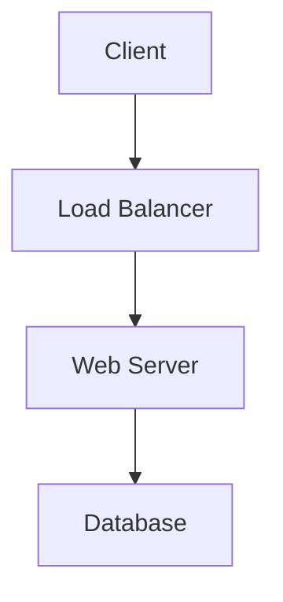

# PMS Platform Documentation

This repository contains the official documentation for the PMS (Portfolio Management System) platform. The documentation is built using [Docusaurus](https://docusaurus.io/), a modern static website generator.

## 🌐 Documentation Site

The documentation is available at: https://pms-org.github.io/pms-docs

## 📚 Documentation Structure

The documentation is organized into the following sections:

- **Platform**: Core platform concepts, architecture, and configuration
- **Services**: Individual service documentation (auth, analytics, portfolio, etc.)
- **Frontend**: Frontend application documentation and integration guides
- **Infrastructure**: EKS, networking, and infrastructure documentation
- **Operations**: Deployment, monitoring, and operational runbooks
- **Reference**: API endpoints, ports/protocols, and glossary

## 🚀 Local Development

### Prerequisites

- Node.js >= 18.0
- npm >= 9.0

### Installation

Clone the repository and install dependencies:

```bash
git clone https://github.com/pms-org/pms-docs.git
cd pms-docs
npm install
```

### Start the Development Server

```bash
npm start
```

This command starts a local development server and opens up a browser window. Most changes are reflected live without having to restart the server.

### Build

```bash
npm run build
```

This command generates static content into the `build` directory and can be served using any static contents hosting service.

### Serve the Built Site

```bash
npm run serve
```

This command serves the production build locally for testing.

## 📝 Adding Documentation

### Creating New Documents

1. Create a new `.md` file in the appropriate directory under `docs/`
2. Add frontmatter at the top of the file:

```markdown
---
sidebar_position: 1
title: Your Document Title
---

# Your Document Title

Your content here...
```

3. If creating a new section, update `sidebars.ts` to include your new document

### Documentation Guidelines

- Use clear, concise language
- Include code examples where appropriate
- Use Mermaid diagrams for architecture and flow diagrams
- Follow the existing document structure and style
- Add appropriate frontmatter to all documents

### Mermaid Diagrams

This site supports Mermaid diagrams. Example:

````markdown

````

## 🚢 Deployment

The documentation is automatically deployed to GitHub Pages when changes are pushed to the `main` branch.

### Manual Deployment

To manually deploy (not recommended):

```bash
npm run build
# The build output is in the 'build' directory
```

### GitHub Actions

The repository uses GitHub Actions for continuous deployment. The workflow is defined in `.github/workflows/deploy.yml` and automatically builds and deploys the documentation on every push to the `main` branch.

## 🛠️ Configuration

- `docusaurus.config.ts`: Main configuration file
- `sidebars.ts`: Sidebar navigation configuration
- `tsconfig.json`: TypeScript configuration
- `src/css/custom.css`: Custom CSS styles

## 📦 Key Dependencies

- **@docusaurus/core**: Core Docusaurus functionality
- **@docusaurus/preset-classic**: Classic theme and plugins
- **@docusaurus/theme-mermaid**: Mermaid diagram support
- **TypeScript**: Type safety and better development experience

## 🤝 Contributing

1. Create a new branch for your changes
2. Make your documentation updates
3. Test locally with `npm start`
4. Build to verify no errors: `npm run build`
5. Commit and push your changes
6. Create a pull request

## 📄 License

See the [LICENSE](LICENSE) file for details.

## 🔗 Useful Links

- [Docusaurus Documentation](https://docusaurus.io/)
- [Markdown Guide](https://www.markdownguide.org/)
- [Mermaid Diagram Syntax](https://mermaid.js.org/)
- [PMS Organization](https://github.com/pms-org)

