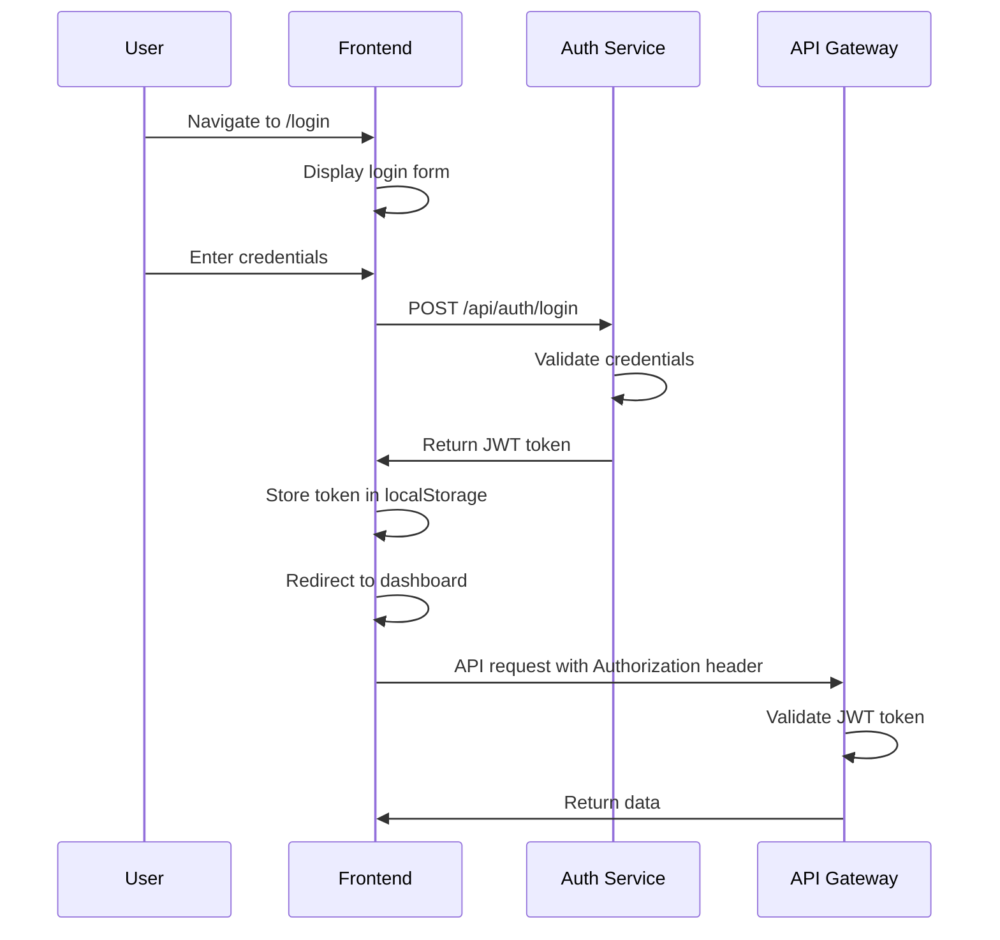

# Frontend Auth Integration

This guide covers the authentication and authorization implementation in the PMS Frontend application.

## Authentication Architecture

### Current Implementation

The application uses a **token-based authentication** system suitable for internal enterprise deployments:

- **JWT Tokens**: Access tokens stored in localStorage
- **HTTP Interceptors**: Automatic token attachment to API requests
- **Route Guards**: Protection of authenticated routes
- **Trusted Environment**: Designed for deployments behind corporate firewalls

### Authentication Flow



## Core Components

### AuthService

**Location:** `src/app/core/services/auth.service.ts`

```typescript
@Injectable({
  providedIn: "root",
})
export class AuthService {
  private readonly http = inject(HttpClient);
  private readonly runtimeConfig = inject(RuntimeConfigService);
  private readonly baseUrl = this.runtimeConfig.auth.baseHttp;

  login(credentials: AuthRequest): Observable<AuthResponse> {
    return this.http.post<AuthResponse>(
      `${this.baseUrl}/api/auth/login`,
      credentials,
    );
  }

  signup(credentials: AuthRequest): Observable<AuthResponse> {
    return this.http.post<AuthResponse>(
      `${this.baseUrl}/api/auth/signup`,
      credentials,
    );
  }
}
```

**Key Features:**

- Login and signup functionality
- Runtime configuration for service URLs
- Observable-based API calls
- Type-safe request/response interfaces

### Auth Interceptor

**Location:** `src/app/core/interceptors/auth.interceptor.ts`

```typescript
export const authInterceptor: HttpInterceptorFn = (req, next) => {
  // Skip auth for login and signup endpoints
  if (
    req.url.includes("/api/auth/login") ||
    req.url.includes("/api/auth/signup")
  ) {
    return next(req);
  }

  // Get token from localStorage
  const token = localStorage.getItem("accessToken");

  // If token exists, clone request and add Authorization header
  if (token) {
    const authReq = req.clone({
      setHeaders: {
        Authorization: `Bearer ${token}`,
      },
    });
    return next(authReq);
  }

  // No token, proceed with original request
  return next(req);
};
```

**Functionality:**

- Automatically attaches JWT tokens to API requests
- Skips authentication for login/signup endpoints
- Handles token retrieval from localStorage
- Preserves original request if no token exists

### Auth Guard

**Location:** `src/app/core/guards/auth.guard.ts`

```typescript
export const authGuard: CanActivateFn = () => {
  const router = inject(Router);
  const token = localStorage.getItem("accessToken");

  if (token) {
    return true;
  }

  router.navigate(["/login"]);
  return false;
};
```

**Route Protection:**

- Checks for presence of access token
- Redirects unauthenticated users to login
- Allows authenticated users to access protected routes

## Route Configuration

### Application Routes

**Location:** `src/app/app.routes.ts`

```typescript
export const routes: Routes = [
  {
    path: "login",
    loadComponent: () =>
      import("./features/login/login.component").then((m) => m.LoginComponent),
  },
  {
    path: "signup",
    loadComponent: () =>
      import("./features/signup/signup.component").then(
        (m) => m.SignupComponent,
      ),
  },
  {
    path: "",
    component: ShellComponent,
    canActivate: [authGuard], // Protected routes
    children: [
      { path: "", pathMatch: "full", redirectTo: "dashboard" },
      {
        path: "dashboard",
        loadComponent: () =>
          import("./features/dashboard/dashboard.page").then(
            (m) => m.DashboardPage,
          ),
      },
      // ... other protected routes
    ],
  },
];
```

**Route Structure:**

- Public routes: `/login`, `/signup`
- Protected routes: All others under shell component
- Lazy loading: Components loaded on-demand
- Auth guard: Applied to shell component

## Login Component

### Login Form Implementation

**Location:** `src/app/features/login/login.component.ts`

```typescript
@Component({
  selector: "app-login",
  template: `
    <div class="login-container">
      <form [formGroup]="loginForm" (ngSubmit)="onSubmit()">
        <div class="form-group">
          <label for="username">Username</label>
          <input
            id="username"
            type="text"
            formControlName="username"
            required
          />
        </div>

        <div class="form-group">
          <label for="password">Password</label>
          <input
            id="password"
            type="password"
            formControlName="password"
            required
          />
        </div>

        <button type="submit" [disabled]="loginForm.invalid || loading">
          {{ loading ? "Logging in..." : "Login" }}
        </button>
      </form>
    </div>
  `,
})
export class LoginComponent {
  loginForm = new FormGroup({
    username: new FormControl("", [Validators.required]),
    password: new FormControl("", [Validators.required]),
  });

  loading = false;

  constructor(
    private authService: AuthService,
    private router: Router,
    private toastService: ToastService,
  ) {}

  onSubmit(): void {
    if (this.loginForm.valid) {
      this.loading = true;
      const credentials = this.loginForm.value as AuthRequest;

      this.authService.login(credentials).subscribe({
        next: (response) => {
          localStorage.setItem("accessToken", response.accessToken);
          this.router.navigate(["/dashboard"]);
        },
        error: (error) => {
          this.toastService.showError(
            "Login failed. Please check your credentials.",
          );
          this.loading = false;
        },
      });
    }
  }
}
```

**Features:**

- Reactive forms with validation
- Loading states
- Error handling with toast notifications
- Automatic redirect after successful login
- Token storage in localStorage

## Signup Component

### Registration Form

**Location:** `src/app/features/signup/signup.component.ts`

```typescript
@Component({
  selector: "app-signup",
  template: `
    <div class="signup-container">
      <form [formGroup]="signupForm" (ngSubmit)="onSubmit()">
        <div class="form-group">
          <label for="username">Username</label>
          <input
            id="username"
            type="text"
            formControlName="username"
            required
          />
        </div>

        <div class="form-group">
          <label for="email">Email</label>
          <input id="email" type="email" formControlName="email" required />
        </div>

        <div class="form-group">
          <label for="password">Password</label>
          <input
            id="password"
            type="password"
            formControlName="password"
            required
          />
        </div>

        <button type="submit" [disabled]="signupForm.invalid || loading">
          {{ loading ? "Creating account..." : "Sign Up" }}
        </button>
      </form>
    </div>
  `,
})
export class SignupComponent {
  signupForm = new FormGroup({
    username: new FormControl("", [Validators.required]),
    email: new FormControl("", [Validators.required, Validators.email]),
    password: new FormControl("", [
      Validators.required,
      Validators.minLength(6),
    ]),
  });

  loading = false;

  constructor(
    private authService: AuthService,
    private router: Router,
    private toastService: ToastService,
  ) {}

  onSubmit(): void {
    if (this.signupForm.valid) {
      this.loading = true;
      const credentials = this.signupForm.value as SignupRequest;

      this.authService.signup(credentials).subscribe({
        next: (response) => {
          localStorage.setItem("accessToken", response.accessToken);
          this.router.navigate(["/dashboard"]);
        },
        error: (error) => {
          this.toastService.showError("Signup failed. Please try again.");
          this.loading = false;
        },
      });
    }
  }
}
```

## Token Management

### Token Storage Strategy

**localStorage Implementation:**

```typescript
// Store token after successful login/signup
localStorage.setItem("accessToken", response.accessToken);

// Retrieve token for API requests
const token = localStorage.getItem("accessToken");

// Clear token on logout
localStorage.removeItem("accessToken");
```

**Security Considerations:**

- Tokens stored in localStorage (accessible via JavaScript)
- Suitable for internal enterprise applications
- Should be upgraded to httpOnly cookies for higher security
- Consider token refresh mechanism for production

### Token Validation

**Client-side Token Checks:**

```typescript
export class AuthService {
  isAuthenticated(): boolean {
    const token = localStorage.getItem("accessToken");
    if (!token) return false;

    try {
      // Basic JWT validation (decode and check expiry)
      const payload = JSON.parse(atob(token.split(".")[1]));
      const currentTime = Date.now() / 1000;
      return payload.exp > currentTime;
    } catch {
      return false;
    }
  }
}
```

## Error Handling

### Authentication Errors

**HTTP Interceptor Error Handling:**

```typescript
@Injectable()
export class ErrorRetryInterceptor implements HttpInterceptor {
  intercept(
    req: HttpRequest<any>,
    next: HttpHandler,
  ): Observable<HttpEvent<any>> {
    return next.handle(req).pipe(
      catchError((error: HttpErrorResponse) => {
        if (error.status === 401) {
          // Token expired or invalid
          localStorage.removeItem("accessToken");
          this.router.navigate(["/login"]);
          return throwError(() => error);
        }
        return throwError(() => error);
      }),
    );
  }
}
```

**Common Error Scenarios:**

- **401 Unauthorized**: Token expired/invalid → redirect to login
- **403 Forbidden**: Insufficient permissions → show error message
- **400 Bad Request**: Invalid credentials → display validation errors

## Security Considerations

### Current Security Model

**Trusted Environment Assumptions:**

- Application deployed behind corporate firewall
- Users authenticated via corporate network
- HTTPS enforced at infrastructure level
- No sensitive data stored client-side

### Production Security Enhancements

**Recommended Improvements:**

```typescript
// 1. HttpOnly cookies for token storage
// 2. CSRF protection
// 3. Token refresh mechanism
// 4. Secure token validation
// 5. Rate limiting for auth endpoints
// 6. Multi-factor authentication
```

### HTTPS Enforcement

**Production Environment:**

```typescript
// environment.prod.ts
export const environment = {
  production: true,
  // All URLs must use HTTPS/WSS
  auth: {
    baseHttp: "https://auth.yourdomain.com",
  },
  // ... other services
};
```

## Testing Authentication

### Unit Tests

**AuthService Testing:**

```typescript
describe("AuthService", () => {
  let service: AuthService;
  let httpMock: HttpTestingController;

  beforeEach(() => {
    TestBed.configureTestingModule({
      imports: [HttpClientTestingModule],
      providers: [AuthService],
    });
    service = TestBed.inject(AuthService);
    httpMock = TestBed.inject(HttpTestingController);
  });

  it("should login successfully", () => {
    const mockResponse = { accessToken: "token123", tokenType: "Bearer" };

    service
      .login({ username: "test", password: "pass" })
      .subscribe((response) => {
        expect(response.accessToken).toBe("token123");
      });

    const req = httpMock.expectOne("/api/auth/login");
    expect(req.request.method).toBe("POST");
    req.flush(mockResponse);
  });
});
```

### Integration Tests

**Login Flow Testing:**

```typescript
describe("LoginComponent", () => {
  let component: LoginComponent;
  let fixture: ComponentFixture<LoginComponent>;
  let authServiceSpy: jasmine.SpyObj<AuthService>;

  beforeEach(async () => {
    const spy = jasmine.createSpyObj("AuthService", ["login"]);

    await TestBed.configureTestingModule({
      imports: [ReactiveFormsModule],
      declarations: [LoginComponent],
      providers: [{ provide: AuthService, useValue: spy }],
    }).compileComponents();

    fixture = TestBed.createComponent(LoginComponent);
    component = fixture.componentInstance;
    authServiceSpy = TestBed.inject(AuthService) as jasmine.SpyObj<AuthService>;
  });

  it("should login on valid form submission", () => {
    component.loginForm.setValue({ username: "test", password: "pass" });
    authServiceSpy.login.and.returnValue(of({ accessToken: "token" }));

    component.onSubmit();

    expect(authServiceSpy.login).toHaveBeenCalledWith({
      username: "test",
      password: "pass",
    });
  });
});
```

## Future Authentication Enhancements

### Planned Features

**OAuth2/OpenID Connect Integration:**

```typescript
// Future OAuth2 implementation
@Injectable({ providedIn: "root" })
export class OAuth2Service {
  login(): Observable<void> {
    // Redirect to OAuth2 provider
    return this.oauth2Flow();
  }

  handleCallback(code: string): Observable<AuthTokens> {
    // Exchange code for tokens
    return this.exchangeCodeForTokens(code);
  }
}
```

**Role-Based Access Control:**

```typescript
interface User {
  id: string;
  username: string;
  roles: string[];
  permissions: string[];
}

@Injectable({ providedIn: "root" })
export class AuthorizationService {
  hasRole(role: string): boolean {
    // Check if user has specific role
    return this.currentUser.roles.includes(role);
  }

  hasPermission(permission: string): boolean {
    // Check if user has specific permission
    return this.currentUser.permissions.includes(permission);
  }
}
```

**Token Refresh Mechanism:**

```typescript
@Injectable({ providedIn: "root" })
export class TokenService {
  refreshToken(): Observable<AuthTokens> {
    const refreshToken = localStorage.getItem("refreshToken");
    return this.http.post<AuthTokens>("/api/auth/refresh", { refreshToken });
  }

  scheduleTokenRefresh(): void {
    // Schedule automatic token refresh before expiry
    const expiresIn = this.getTokenExpiry();
    setTimeout(() => this.refreshToken(), expiresIn - 60000); // Refresh 1 min before expiry
  }
}
```

## Troubleshooting

### Common Authentication Issues

**1. Token Not Attached to Requests**

```typescript
// Debug interceptor
console.log("Request headers:", req.headers);
console.log("Token from localStorage:", localStorage.getItem("accessToken"));
```

**2. Redirect Loop**

```typescript
// Check auth guard logic
console.log("Token exists:", !!localStorage.getItem("accessToken"));
console.log("Current route:", this.router.url);
```

**3. CORS Issues**

```typescript
// Check CORS configuration in proxy.conf.json
{
  "/api/auth/*": {
    "target": "http://auth-service:8085",
    "secure": false,
    "changeOrigin": true
  }
}
```

**4. Token Expiry**

```typescript
// Check token validity
const token = localStorage.getItem("accessToken");
if (token) {
  const payload = JSON.parse(atob(token.split(".")[1]));
  console.log("Token expires:", new Date(payload.exp * 1000));
}
```

## Configuration Checklist

### Development Setup

- [ ] Auth service URL configured in environment files
- [ ] Proxy configuration includes auth endpoints
- [ ] CORS settings allow frontend domain
- [ ] Auth interceptor properly configured

### Production Deployment

- [ ] HTTPS enforced for all auth endpoints
- [ ] Secure token storage (consider httpOnly cookies)
- [ ] CSRF protection enabled
- [ ] Rate limiting configured
- [ ] Audit logging enabled

### Security Validation

- [ ] Token validation working correctly
- [ ] Route protection functioning
- [ ] Unauthorized access blocked
- [ ] Secure logout implemented
- [ ] Session management configured
