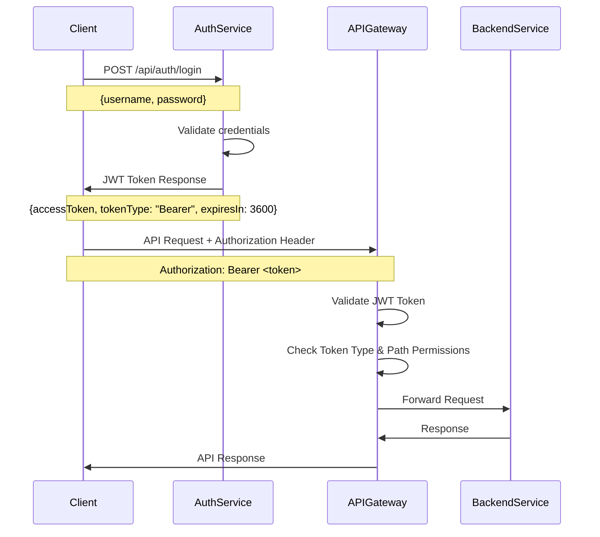
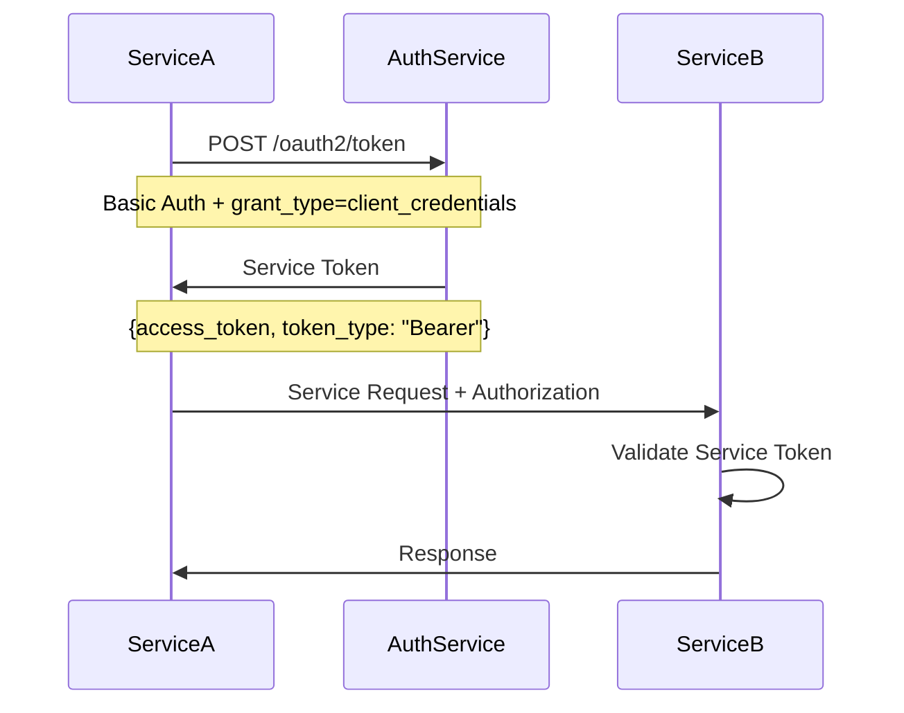

---
sidebar_position: 5
title: Authentication Flow
---

# Authentication Flow

## Overview

The PMS platform implements a comprehensive authentication and authorization system based on OAuth 2.0 and JWT (JSON Web Tokens). The system supports two primary token types: USER tokens for end-user authentication and SERVICE tokens for service-to-service communication.

## Architecture Components

### Authentication Service
- **Endpoint**: `/api/auth/login`
- **Protocol**: HTTP POST with JSON payload
- **Token Type**: Bearer JWT
- **Expiration**: 1 hour (3600 seconds)

### API Gateway Security
- **Framework**: Spring Cloud Gateway with reactive security
- **Authentication**: JWT resource server
- **Authorization**: Path-based access control with token type validation

### Token Types

#### USER Tokens
- **Purpose**: End-user authentication for client applications
- **Scope**: `ROLE_USER`
- **Usage**: Portfolio creation, simulation, and user-facing operations
- **Validation**: Required for `/api/portfolio/**` and `/simulation/**` endpoints

#### SERVICE Tokens
- **Purpose**: Machine-to-machine authentication
- **Scope**: `service`
- **Usage**: Inter-service communication and automated processes
- **Grant Type**: `client_credentials`

## Authentication Flow

### User Authentication Flow



### Service Authentication Flow



## Security Configuration

### API Gateway Path Matching

```java
@Configuration
public class SecurityConfig {

    @Bean
    public SecurityWebFilterChain springSecurityFilterChain(ServerHttpSecurity http) {
        return http
            .authorizeExchange(exchanges -> exchanges
                // Public endpoints
                .pathMatchers("/api/auth/**", "/oauth2/**").permitAll()

                // USER token required
                .pathMatchers("/api/portfolio/**", "/simulation/**")
                    .access((authentication, context) ->
                        authentication
                            .map(auth -> auth.getToken().getClaimAsString("tokenType"))
                            .map(tokenType -> "USER".equals(tokenType))
                    )

                // SERVICE token required
                .pathMatchers("/api/analytics/**", "/api/validation/**")
                    .access((authentication, context) ->
                        authentication
                            .map(auth -> auth.getToken().getClaimAsString("tokenType"))
                            .map(tokenType -> "SERVICE".equals(tokenType))
                    )

                // All other requests authenticated
                .anyExchange().authenticated()
            )
            .oauth2ResourceServer(oauth2 -> oauth2
                .jwt(Customizer.withDefaults())
            )
            .build();
    }
}
```

### JWT Token Structure

```json
{
  "iss": "http://auth:8081",
  "sub": "testuser",
  "exp": 1770568630,
  "tokenType": "USER",
  "iat": 1770565030,
  "scope": "ROLE_USER"
}
```

## Token Management

### Expiration Handling
- **USER Tokens**: 1-hour expiration with automatic renewal capability
- **SERVICE Tokens**: Configurable expiration (default 1 hour)
- **Refresh Tokens**: Not implemented (tokens are short-lived)

### Token Validation
- **Issuer Validation**: Tokens must be issued by the Auth service
- **Signature Verification**: RSA-based signature validation
- **Expiration Check**: Automatic rejection of expired tokens
- **Token Type Enforcement**: Path-specific token type requirements

## Error Handling

### Authentication Errors

| HTTP Status | Error | Description |
|-------------|-------|-------------|
| 401 | Unauthorized | Invalid or missing token |
| 403 | Forbidden | Valid token but insufficient permissions |
| 401 | Token Expired | JWT token has expired |
| 401 | Invalid Token | Malformed or tampered token |

### Common Issues

#### Token Expiration
```bash
# Error Response
{
  "timestamp": "2026-02-09T15:37:32.000+00:00",
  "status": 401,
  "error": "Unauthorized",
  "message": "JWT token has expired"
}
```

#### Wrong Token Type
```bash
# Error Response
{
  "timestamp": "2026-02-09T15:37:32.000+00:00",
  "status": 403,
  "error": "Forbidden",
  "message": "Access denied for token type: SERVICE"
}
```

## Best Practices

### Client Applications
1. **Token Storage**: Store tokens securely (HttpOnly cookies, secure storage)
2. **Token Renewal**: Implement automatic token refresh before expiration
3. **Error Handling**: Handle 401 responses by redirecting to login
4. **Token Type Awareness**: Use appropriate token types for different operations

### Service Integration
1. **Service Tokens**: Use SERVICE tokens for inter-service communication
2. **Token Caching**: Cache service tokens to reduce authentication overhead
3. **Retry Logic**: Implement exponential backoff for authentication failures
4. **Monitoring**: Monitor token validation failures and expiration rates

### Security Considerations
1. **HTTPS Only**: Always use HTTPS for token transmission
2. **Token Rotation**: Regularly rotate service client credentials
3. **Audit Logging**: Log authentication events for security monitoring
4. **Rate Limiting**: Implement rate limiting on authentication endpoints

## Troubleshooting

### Debug Token Validation
```bash
# Check token claims
curl -H "Authorization: Bearer <token>" \
     -H "Content-Type: application/json" \
     http://localhost:8080/api/debug/token
```

### Validate Token Structure
```bash
# Decode JWT (without verification)
echo "<token>" | cut -d'.' -f2 | base64 -d | jq
```

### Test Authentication Flow
```bash
# 1. Get token
TOKEN=$(curl -X POST http://localhost:8080/api/auth/login \
  -H "Content-Type: application/json" \
  -d '{"username": "testuser", "password": "password123"}' | jq -r '.accessToken')

# 2. Test protected endpoint
curl -H "Authorization: Bearer $TOKEN" \
     http://localhost:8080/api/portfolio/list
```
