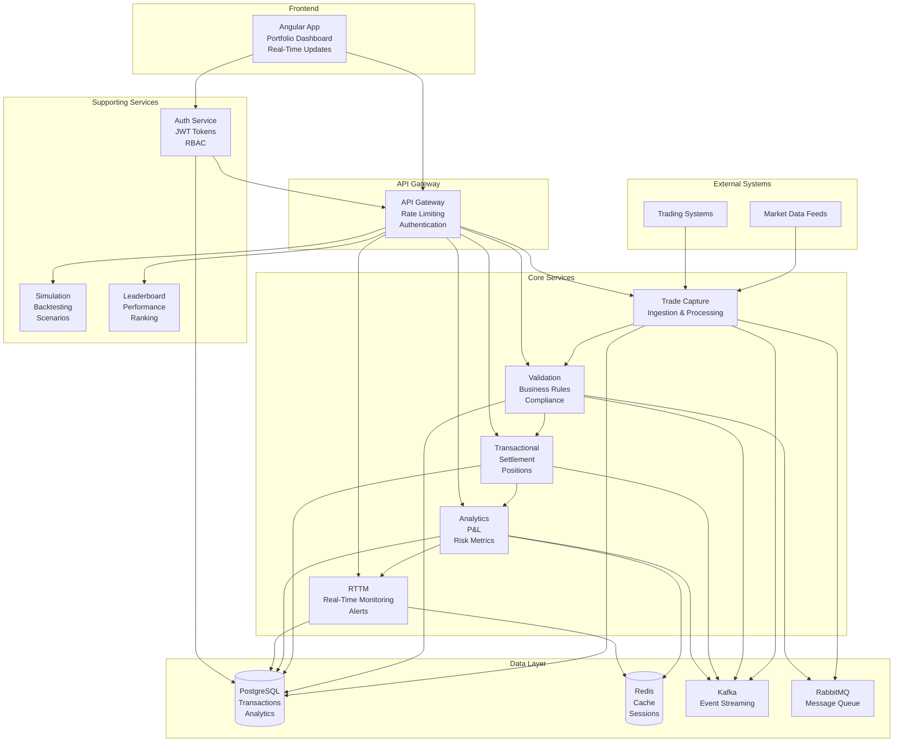

---

sidebar_position: 1
title: Platform Overview

---

# Platform Overview

## What is PMS?

The Portfolio Management System (PMS) is a comprehensive, enterprise-grade financial technology platform designed for real-time portfolio management, trade processing, and analytics. Built with modern microservices architecture, PMS provides institutional-grade capabilities for managing investment portfolios with high-frequency trading data, real-time risk analytics, and automated compliance validation.

## Key Features

### 🚀 Real-Time Processing

- **High-Frequency Trade Capture**: Processes thousands of trades per second with sub-millisecond latency
- **Real-Time Analytics**: Continuous portfolio valuation and risk assessment
- **Live Market Data Integration**: Real-time market data feeds with STOMP/WebSocket broadcasting

### 📊 Advanced Analytics

- **Portfolio Analytics**: Real-time P&L calculations, position tracking, and performance metrics
- **Risk Management**: Automated risk assessment with configurable thresholds and alerts
- **Sector Analysis**: Market sector performance tracking and correlation analysis

### 🔒 Enterprise Security

- **JWT Authentication**: Secure token-based authentication with role-based access control
- **Multi-Tenant Architecture**: Isolated environments for different user groups
- **Audit Logging**: Comprehensive audit trails for all financial transactions

### ⚡ High Availability

- **Microservices Architecture**: Independent, scalable service components
- **Kubernetes Orchestration**: Automated deployment, scaling, and self-healing
- **Database Replication**: PostgreSQL with high availability and automatic failover

## Architecture Overview

### System Components

PMS is built on a modern microservices architecture deployed on AWS EKS (Elastic Kubernetes Service) with the following key components:

#### Core Services

- **Trade Capture**: High-performance trade ingestion and initial processing
- **Validation**: Real-time trade validation against business rules and market data
- **Transactional**: Trade settlement and position management
- **Analytics**: Portfolio analytics, P&L calculations, and reporting
- **RTTM (Real-Time Trade Monitoring)**: Live position tracking and alert generation
- **Simulation**: Trade simulation and backtesting capabilities

#### Supporting Services

- **Auth Service**: Authentication and authorization management
- **API Gateway**: Centralized API routing and rate limiting
- **Frontend**: Angular-based web application for portfolio management
- **Leaderboard**: Performance ranking and competitive analytics

#### Infrastructure Services

- **PostgreSQL**: Primary database for transactional and analytical data
- **Redis**: High-performance caching and session management
- **Kafka**: Event streaming for inter-service communication
- **RabbitMQ**: Message queuing for trade processing workflows
- **Schema Registry**: Avro schema management for Kafka messages

### Technology Stack

| Component            | Technology             | Purpose                      |
| -------------------- | ---------------------- | ---------------------------- |
| **Backend Services** | Spring Boot 3.x        | REST APIs, business logic    |
| **Frontend**         | Angular 21, TypeScript | Web application              |
| **Database**         | PostgreSQL 16          | Primary data storage         |
| **Cache**            | Redis 7.x              | Session and data caching     |
| **Message Broker**   | Apache Kafka 3.x       | Event streaming              |
| **Message Queue**    | RabbitMQ 3.x           | Workflow processing          |
| **Orchestration**    | Kubernetes 1.28+       | Container orchestration      |
| **Deployment**       | ArgoCD                 | GitOps continuous deployment |
| **Infrastructure**   | Terraform              | Infrastructure as Code       |
| **Monitoring**       | Prometheus + Grafana   | Metrics and visualization    |
| **Logging**          | ELK Stack              | Centralized logging          |

## Deployment Strategy

### GitOps with ArgoCD

PMS implements a GitOps-driven deployment strategy where:

- All infrastructure and application manifests are stored in Git
- ArgoCD continuously monitors Git repositories for changes
- Automated deployments ensure consistency across environments
- Rollbacks are achieved through Git operations

### Multi-Environment Architecture

- **Development**: Feature development and testing
- **Staging**: Integration testing and validation
- **Production**: Live system with high availability

### Infrastructure as Code

- **Terraform**: Cloud infrastructure provisioning (EKS, RDS, networking)
- **Kustomize**: Kubernetes manifest templating and environment management
- **Helm**: Package management for complex applications

## Service Architecture

## Data Flow

1. **Trade Ingestion**: Market data and trading system feeds enter through Trade Capture service
2. **Validation**: Trades are validated against business rules and market data
3. **Processing**: Valid trades are processed for settlement and position updates
4. **Analytics**: Real-time P&L calculations and risk assessments
5. **Monitoring**: Continuous position monitoring with automated alerts
6. **Reporting**: Analytics data served to frontend dashboards via WebSocket connections

## Security Model

### Authentication & Authorization

- JWT-based authentication with configurable token expiration
- Role-based access control (RBAC) for different user types
- Multi-factor authentication support
- Secure API key management for external integrations

### Data Protection

- End-to-end encryption for sensitive data
- AWS Secrets Manager integration for credential management
- Database encryption at rest and in transit
- Network segmentation and security groups

### Compliance

- Comprehensive audit logging for all financial transactions
- SOC 2 Type II compliance framework
- GDPR compliance for data privacy
- Automated compliance reporting

## Monitoring & Observability

### Metrics Collection

- **Prometheus**: Service metrics, performance indicators, and health checks
- **Grafana**: Real-time dashboards and alerting
- **Custom Metrics**: Business-specific KPIs and SLIs

### Logging

- **ELK Stack**: Centralized logging with Elasticsearch, Logstash, and Kibana
- **Structured Logging**: JSON-formatted logs with correlation IDs
- **Log Aggregation**: Multi-service log correlation and analysis

### Alerting

- **Real-time Alerts**: Automated notifications for system issues and business events
- **Escalation Policies**: Configurable alert routing and escalation
- **Incident Response**: Integrated incident management and resolution workflows

## Performance Characteristics

### Scalability

- **Horizontal Scaling**: Services can scale independently based on load
- **Auto-scaling**: Kubernetes HPA (Horizontal Pod Autoscaler) for dynamic scaling
- **Database Scaling**: Read replicas and connection pooling for high throughput

### Reliability

- **99.9% Uptime SLA**: Enterprise-grade availability requirements
- **Circuit Breakers**: Fault tolerance and graceful degradation
- **Retry Logic**: Automatic retry with exponential backoff for transient failures

### Performance Benchmarks

- **Trade Processing**: 10,000+ trades per second
- **API Response Time**: `<100ms` P95 for core APIs
- **Real-time Updates**: `<50ms` latency for WebSocket broadcasts

This overview provides the foundation for understanding the PMS platform. For detailed implementation guides, refer to the specific documentation sections for each component.
